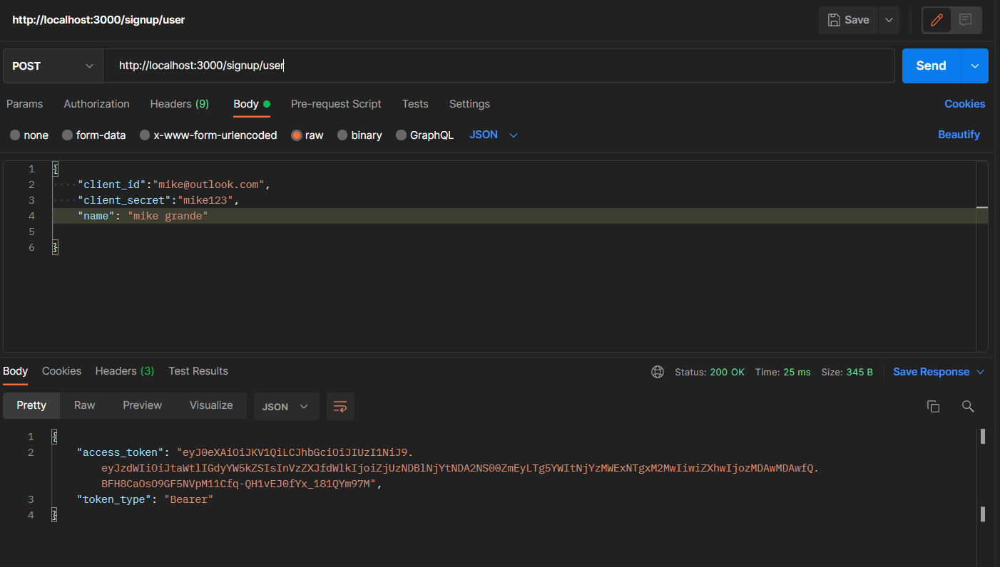
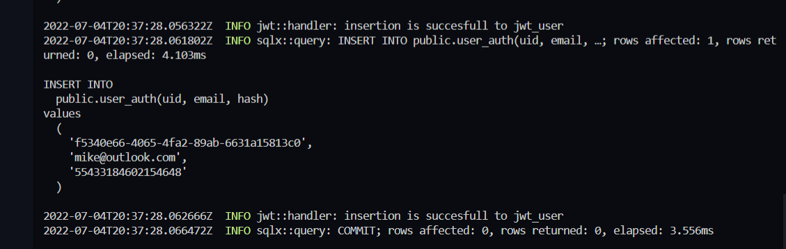
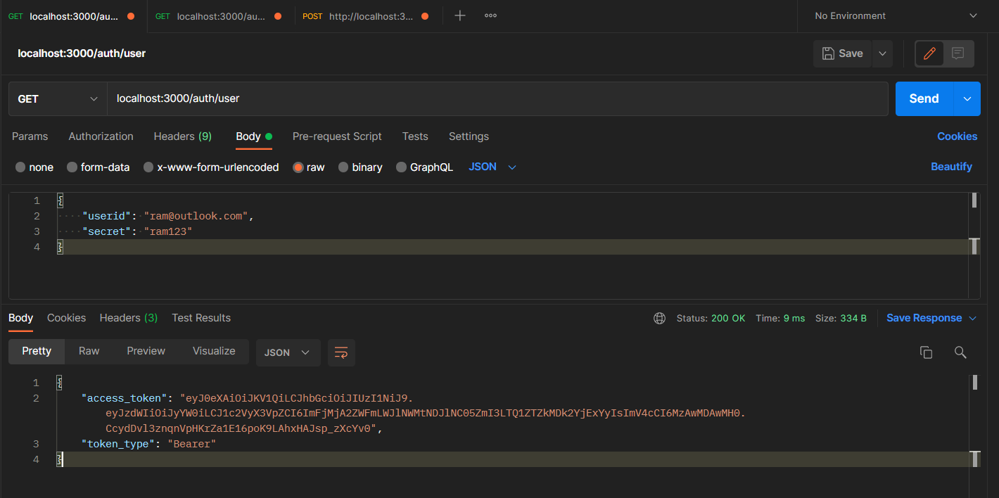
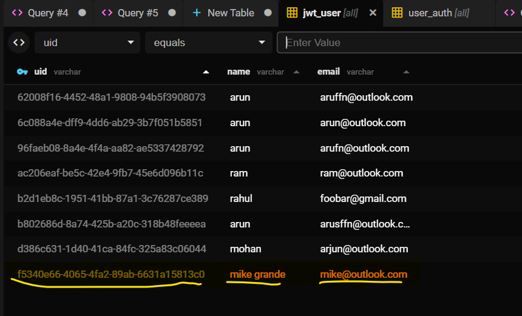
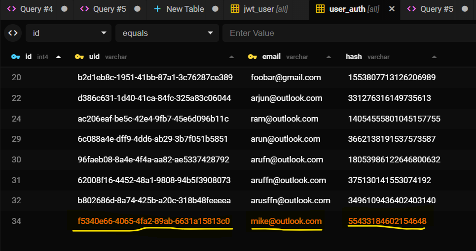

# Project Demo
currently the project consists of couples of routes for Authentication & Authorization
#
```
GET localhost:3000/signup/:id
```
for creating a json web token using email & pw and name
in body

## User Sign up

## Terminal


#

```
GET localhost:3000/auth/user
```
for verifying the user body and further returning the jwt token in body 

## User log in

#

Database log of the user's credential values on table


#

Database log of the user's & password hash values on table 


#